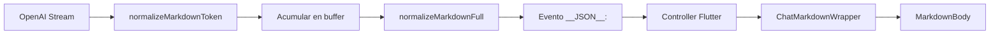

# Fix: Formato Markdown en Respuestas Médicas

## Problema Identificado

Las respuestas médicas del backend llegaban al frontend sin formato apropiado:

```text
❌ ANTES (mal formateado):
# Frantz Tumor: Definición## Resumen- El tumor es raro.- Representa 1%-3%.## Análisis...
```

```text
✅ DESPUÉS (bien formateado):
# Frantz Tumor: Definición

## Resumen

- El tumor es raro.
- Representa 1%-3%.

## Análisis
...
```

## Causa Raíz

1. **OpenAI concatena contenido en streaming** sin separadores apropiados
2. **normalizeMarkdownToken()** trabajaba token por token, sin ver contexto completo
3. **Frontend procesaba texto ya degradado** y no podía recuperar el formato

## Solución Implementada

### Backend (Go)

**Archivo**: `backend/conversations_ia/handler.go`

1. **Nueva función `normalizeMarkdownFull()`**:
   - Procesa texto COMPLETO al final del streaming
   - Ve todo el contexto para correcciones precisas
   - Se ejecuta UNA VEZ antes de enviar `__JSON__:`

2. **Características**:
   - ✅ Separa headers pegados: `"texto## Header"` → `"texto\n\n## Header"`
   - ✅ Espaciado entre headers consecutivos
   - ✅ Saltos después de headers antes de contenido
   - ✅ Separa bullets pegados: `"texto:- Item"` → `"texto:\n- Item"`
   - ✅ Preserva guiones internos: `"médico-quirúrgico"` no se rompe
   - ✅ Limpia múltiples saltos (máximo 2)
   - ✅ Normaliza sección "## Fuentes"

3. **Tests implementados**:
   - `backend/conversations_ia/handler_test.go`
   - 8 casos de prueba específicos
   - Validación de preservación de formato correcto

### Frontend (Flutter)

**Archivo**: `lib/app/chat/widgets/chat_markdown_wrapper.dart`

1. **Simplificación de `_processRawContent()`**:
   - Eliminadas regex complejas (backend ya normaliza)
   - Solo limpieza final mínima
   - Confía en evento `__JSON__:` del backend

2. **Mejoras en `chat_controller.dart`**:
   - Logging detallado del evento `__JSON__:`
   - Conteo de patrones markdown (H1, H2, bullets)
   - Preview visual con saltos de línea marcados

## Flujo Mejorado



## Archivos Modificados

1. ✅ `backend/conversations_ia/handler.go`
   - Nueva función `normalizeMarkdownFull()`
   - Integración en `sseStream()`

2. ✅ `backend/conversations_ia/handler_test.go`
   - Tests completos de normalización

3. ✅ `lib/app/chat/widgets/chat_markdown_wrapper.dart`
   - Simplificación del procesamiento

4. ✅ `lib/app/chat/controllers/chat_controller.dart`
   - Logging mejorado de evento `__JSON__:`

## Validación

### Tests Backend

```bash
cd backend
go test -v ./conversations_ia/... -run TestNormalize
```

**Resultado**: ✅ PASS (8/8 tests)

### Tests Frontend

Los tests visuales se pueden ejecutar con:

```bash
flutter run -t test_markdown_visual.dart
```

## Formato Esperado

El backend ahora garantiza este formato:

```markdown
# Título Principal

## Sección 1

Párrafo de contenido normal.

- Bullet 1
- Bullet 2

## Sección 2

Más contenido.

1. Lista numerada
2. Segundo item

## Fuentes

Referencias bibliográficas aquí.
```

## Principios de Diseño

1. **Backend responsable de formato**: El backend normaliza UNA VEZ antes de `__JSON__:`
2. **Frontend confía en backend**: Procesamiento mínimo en Flutter
3. **Evento `__JSON__:` como fuente de verdad**: Contiene texto perfectamente formateado
4. **Tests garantizan calidad**: No regressions en formato

## Próximos Pasos Opcionales

- [ ] Agregar más casos edge a los tests
- [ ] Validar con respuestas PubMed largas
- [ ] Optimizar regex para performance (si necesario)
- [ ] Considerar cache de normalización para respuestas repetidas

## Notas Técnicas

- **Saltos de línea reales**: El backend envía `\n` reales, NO literales `"\\n"`
- **Compatibilidad**: Funciona con texto ya bien formateado (no rompe formato existente)
- **Performance**: Normalización ocurre 1 vez al final, no impacta streaming visual
- **Markdown estándar**: Compatible con `flutter_markdown` sin configuración especial

---

**Fecha**: 5 de noviembre, 2025  
**Versión**: EMA-V2  
**Estado**: ✅ Implementado y testeado
